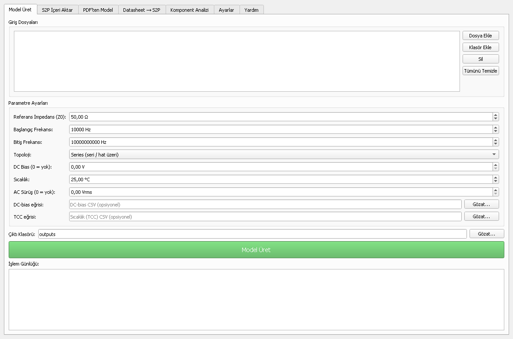
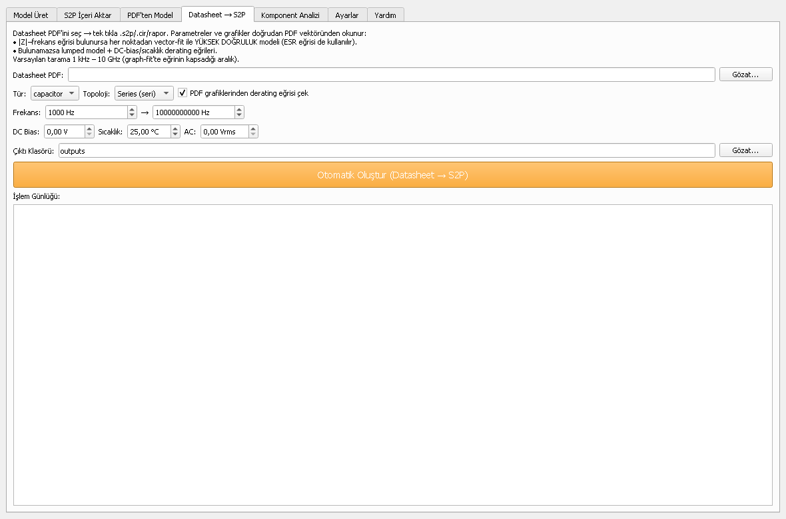
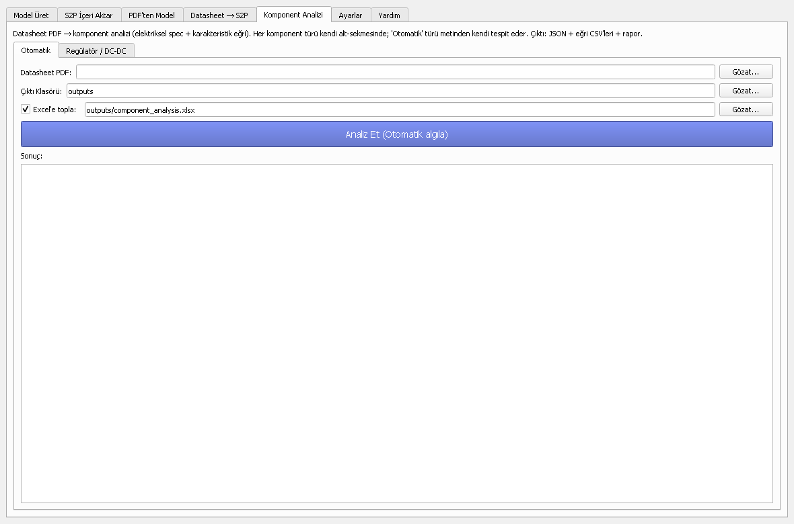

# S2P Model Generator — Datasheet to Simulation Models

[](https://www.python.org/)
[](#generated-outputs)
[](#generated-outputs)
[](#validation)
[](https://github.com/kaanelectronicrun-lgtm/s2p-model-generator/releases/latest)

Converts **capacitor** and **inductor** datasheet parameters into simulation-ready
electrical models: SPICE subcircuits, Touchstone `.s2p` S-parameters, an impedance
table, and a senior-SI/PI engineering report.

The desktop application also extracts passive-component curves from datasheet PDFs,
imports measured/vendor Touchstone files and produces structured regulator/DC-DC
component analyses.

## Desktop Application

<p align="center">
  
  
  
</p>

- JSON, PDF and Touchstone input paths
- Lumped and broadband vector-fit model generation
- PyQt5 desktop GUI and standalone Windows build
- Datasheet curve extraction with explicit confidence reporting
- Structured JSON/CSV/Markdown/Excel component-analysis outputs

> **Scope:** capacitors and inductors **only**. Ferrite beads, common-mode chokes,
> TVS, connectors, crystals, filters, MOSFETs, ICs, IBIS and transmission lines are
> out of scope and will be rejected.

> ⚠️ Generated S-parameters are **behavioral / estimated** models, never presented
> as manufacturer-measured data. Source level and confidence are reported per model.

## Install

```bash
cd "s2p"
python -m pip install -r requirements.txt   # numpy only; scikit-rf optional
```

Launch the desktop application:

```bash
python gui_main.py
```

## Run

```bash
python run.py components/example_cap.json
python run.py components/example_ind.json -o outputs
python run.py "components/*.json"           # batch (quote the glob)
```

<a id="generated-outputs"></a>

Each part produces, in `outputs/`:

| File | Contents |
|------|----------|
| `<part>.s2p` | Touchstone v1, `# Hz S RI R 50` — S11/S21/S12/S22 |
| `<part>.cir` | SPICE subckt (LTspice / SIwave / HFSS Circuit / ADS) |
| `<part>_report.md` | Summary, equivalent circuit, validation, accuracy, engineering review |
| `<part>_Zf.csv` | Z(f): real, imag, magnitude, phase |

## Two model paths

**1. Lumped (default)** — analytic RLC model from the parameters you type.
Fast, exact at one resonance. Source ★★ datasheet / ★ physics.

**2. Graph fit (vector fitting + RLC synthesis)** — add a `graphs` block pointing
at digitized datasheet curves (`|Z|` vs f, optionally `ESR` vs f). The tool
reconstructs the complex `Z(f)`, runs **vector fitting** (Gustavsen pole-residue),
enforces stability (poles → LHP) and passivity (`Re(Z) ≥ ESR_min`), then generates
the `.s2p` from the *fit* — capturing multi-resonance / frequency-dependent loss
the lumped model can't. Source ★★★ graph fit.

The `.cir` here is a **synthesized broadband RLC ladder** (Foster-I): the model
order is chosen adaptively as the most accurate vector fit that still realizes to
an all-positive-element (passive) network, so the netlist is physically meaningful
and its impedance equals the `.s2p` by construction. The report states the pole
count, RMS fit error, passivity-perturbed points, and branch count.

```bash
python run.py components/example_cap_graph.json     # graph-fit demo
python tests/test_vectorfit.py                      # fitter self-tests
```

Digitize curves with [WebPlotDigitizer](https://automeris.io) → export CSV
(`freq_Hz,value`) into `components/graphs/`. See `example_cap_graph.json`.

## Input format (manual parameter entry)

A component is one JSON file. Fill what the datasheet gives you; leave parasitics
out and the tool back-solves them from the **SRF** (and DF / Q), flagging each as
an estimate.

**Capacitor** — required `kind`, `part_number`, `capacitance_f`. Optional:
`esr_ohm`, `esl_h`, `srf_hz`, `dissipation_factor`, `esr_ref_hz`,
`voltage_rating_v`, `dielectric`, `source` (1–6).

**Inductor** — required `kind`, `part_number`, `inductance_h`. Optional:
`dcr_ohm`, `q_factor`, `q_ref_hz`, `srf_hz`, `cp_f`, `rp_ohm`,
`irms_a`, `isat_a`, `core_material`, `source` (1–6).

All values in **SI base units** (F, H, Ω, Hz). See `components/example_*.json`.

### `source` levels (MODEL SOURCE HIERARCHY)

`1` Measured S-params ★★★★★ · `2` Vendor Touchstone ★★★★ · `3` Vendor SPICE ★★★★ ·
`4` Graph fit ★★★ · `5` Datasheet table ★★ · `6` Physics estimate ★

## Models used

- **Capacitor** — series RLC: `Z = ESR + j(ωL_ESL − 1/ωC)`.
  Missing `ESL = 1/((2π·SRF)²·C)`; missing `ESR = DF/(2π·f·C)`.
- **Inductor** — `(DCR + jωL)` ∥ `Cp` ∥ `Rp`.
  Missing `Cp = 1/((2π·SRF)²·L)`; missing `Rp = Q·ω·L`.
- **Z → S** (series-through 2-port): `S11 = Z/(Z+2Z₀)`, `S21 = 2Z₀/(Z+2Z₀)`.

## Validation

Every model is checked for **passivity** (`|S11|²+|S21|² ≤ 1`), **causality**
(finite rational network), **stability** (`Re(Z) ≥ 0`), and **SRF consistency**
(model vs datasheet within 15%).

## Layout

```
s2p/
├── run.py                  # root launcher
├── requirements.txt
├── components/             # input JSON (one per part)
├── outputs/                # generated models + reports
└── src/s2p_tool/
    ├── models.py           # Capacitor / Inductor / SourceLevel
    ├── parasitics.py       # SRF / DF / Q back-solve
    ├── impedance.py        # Z(f) + log sweep w/ SRF densification
    ├── sparams.py          # Z→S + Touchstone writer
    ├── spice.py            # .cir netlists
    ├── graphs.py           # digitized-curve CSV -> complex Z(f) reconstruction
    ├── vectorfit.py        # Gustavsen vector fitting (rational pole-residue)
    ├── synth.py            # Foster-I RLC-ladder SPICE synthesis (adaptive order)
    ├── validation.py       # passivity/causality/stability/SRF
    ├── report.py           # accuracy + engineering review
    ├── pipeline.py         # orchestration (lumped + graph-fit paths)
    └── cli.py              # argparse entry point
tests/test_vectorfit.py     # fitter self-tests (no pytest needed)
```
